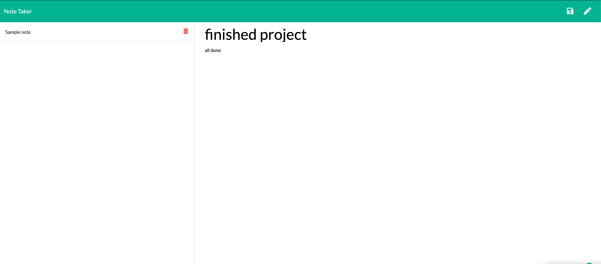

# note-taker

## Approach 

The focus of building this note-taking app was to demonstrate our knowledge of node.js and our ability to build a databse that would be able to house all of the info taken from the front end and be able to post it to the back end and get that information when it was called for. To do this we had to build api and html routes to ensure info was being sent to the right place. These routes were built in the server.js file.

## Installation

To install this repo on your local drive you would have to clone the ssh key from my repo. Head into your local drive of choice in terminal or bash and do a git clone. Once you have done a git clone you are free to start working on this project. If you want to push your changes to my repo then you would have to head into terminal/bash and do a git add . Then a git commit -m explaning the changes made, and finally a git push to push the files onto the repo. 

## Usage 

If you want to use this program, first do a git clone as previously described. Once you have the folder in your vs code then open the integrated terminal by right clicking on the server.js and running the command, node server.js . This will start the program running, follow the prompts and you will have a note taking app up and running.

## Finished project
visit the deployed application at: https://note-taker-mattrward.herokuapp.com/

## Features
<ul>
<li>Given a note-taking application</li>
<li>When I open the Note Taker</li>
<li>Then I am presented with a landing page with a link to a notes page</li>
<li>When I click on the link to the notes page</li>
<li>Then I am presented with a page with existing notes listed in the left-hand column, plus empty fields to enter a new note title and the note’s text in the right-hand column</li>
<li>When I enter a new note title and the note’s text</li>
<li>Then a Save icon appears in the navigation at the top of the page</li>
<li>When I click on the Save icon</li>
<li>Then the new note I have entered is saved and appears in the left-hand column with the other existing notes</li>
<li>When I click on an existing note in the list in the left-hand column</li>
<li>Then that note appears in the right-hand column</li>
<li>When I click on the Write icon in the navigation at the top of the page</li>
<li>Then I am presented with empty fields to enter a new note title and the note’s text in the</li> right-hand column
</ul>

## Tests
N/A

## Credits
N/A

## Contributing

Pull requests are welcome and encouraged. Hit me up on my github <a href="https://github.com/mattrward1030">mattrward1030</a>

## Badges
 

## License

MIT License

Copyright (c) [2021] [Matthew Ward]

Permission is hereby granted, free of charge, to any person obtaining a copy
of this software and associated documentation files (the "Software"), to deal
in the Software without restriction, including without limitation the rights
to use, copy, modify, merge, publish, distribute, sublicense, and/or sell
copies of the Software, and to permit persons to whom the Software is
furnished to do so, subject to the following conditions:

The above copyright notice and this permission notice shall be included in all
copies or substantial portions of the Software.

THE SOFTWARE IS PROVIDED "AS IS", WITHOUT WARRANTY OF ANY KIND, EXPRESS OR
IMPLIED, INCLUDING BUT NOT LIMITED TO THE WARRANTIES OF MERCHANTABILITY,
FITNESS FOR A PARTICULAR PURPOSE AND NONINFRINGEMENT. IN NO EVENT SHALL THE
AUTHORS OR COPYRIGHT HOLDERS BE LIABLE FOR ANY CLAIM, DAMAGES OR OTHER
LIABILITY, WHETHER IN AN ACTION OF CONTRACT, TORT OR OTHERWISE, ARISING FROM,
OUT OF OR IN CONNECTION WITH THE SOFTWARE OR THE USE OR OTHER DEALINGS IN THE
SOFTWARE.
